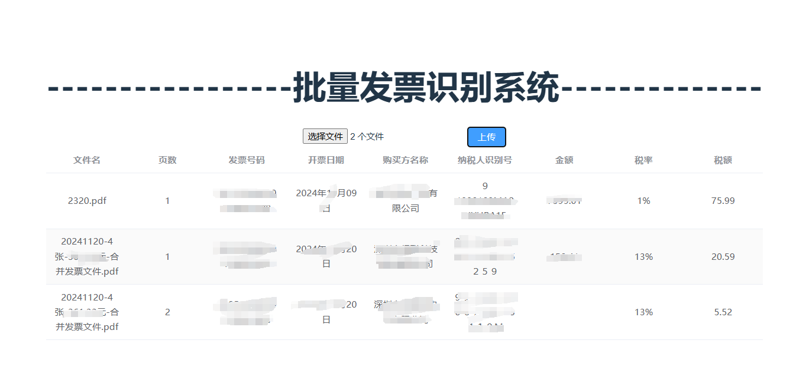

# invoice_OCR-增值税发票识别

## 😄效果展示

### 支持压缩包形式批量导入


### 支持多份PDF文件多页批量导入



## 🧷后端环境配置

git clone  https://github.com/FineHow/invoice_ocr.git

```进入项目
#后端环境配置
cd backend
#创建虚拟环境
python -m venv venv
#激活虚拟环境
venv\Scripts\activate
#安装环境
pip install -r requirements.txt
```

## 启动后端

```返回到项目下目录
cd..
#启动后台
uvicorn main:app --host 0.0.0.0 --port 8000

```

## 🛩前端环境配置

```
cd frontend
npm install
```

## 启动前端页面-开发环境

```
npm run dev
```

* env设置 放入后端ocr服务地址
