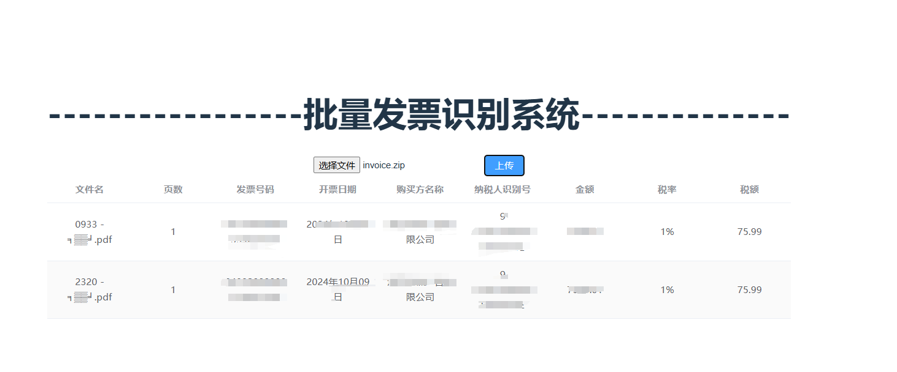

<div align="center">
<a name="readme-top"></a>


<p align="center"><a name="readme-top" ><h1> invoice_OCR 增值税发票识别2.0</h1></a><p align="center">
</div>

✨这是一个基于FASTAPI的增值税发票批量识别系统【优化架构2.0版本】。
🐱‍👓OCR服务支持umiocr,tessartocr,带vision的ai模型*[目前支持gemma3:4b,后期将更新...]*，支持批量输入PDF电子发票/ZIP压缩包(pdf,ofd,xml)三类电子发票格式，格式化识别其中内容，提供相应的WEB页面上传发票，获取信息并返回下载excel。

更新LOG:
🤦‍♂️20250425更新：增加ofd格式，xml 解压识别模块

🛩20250428更新：优化项目架构，优化后端FASTAPI的接口请求路径，集成模块化。

## web效果展示

### 支持压缩包形式批量导入



### 支持多份PDF文件多页批量导入


## 🧷后端环境配置

git clone  https://github.com/FineHow/invoice_ocr.git

```进入项目
#后端环境配置
cd backend
#创建虚拟环境
python -m venv venv
#激活虚拟环境
venv\Scripts\activate
#安装环境
pip install -r requirements.txt
```

## 启动后端

```返回到项目下目录
cd..
#启动后台
uvicorn main:app --host 0.0.0.0 --port 8000
```

## 🛩前端环境配置

```
cd frontend
npm install
```

## 启动前端页面-开发环境

```
npm run dev
```

* env设置 放入后端ocr服务地址,GEMMA3:4B地址,umiocr地址
